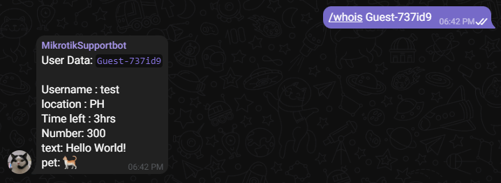

# Telegram Chat Widget  - [Demo](https://mikrotik-support.kentoyyyyyyy.repl.co/)

The **Telegram Chat Widget** is a free and customizable tool forked from idoco/intergram that lets website owners add a chat feature to their sites. Visitors can use it to talk to the website owners through Telegram. It's an easy way for websites to have real-time conversations with their users.


### Adding Telegram Chat Widget in your website with these 2 simple steps

1. Open [Telegram](https://web.telegram.org/), search for **`@MikrotikHsSupportBot`** and hit `/start` to get your unique chat ID.

  <p align="center">  </p>

1. Paste this code snippet right before the closing body tag of every page where you want the chat to appear 
(Don't forget to add your actual chat ID). 

```html
<script> window.intergramId = "Your unique chat id" </script>
<script id="intergram" type="text/javascript" src="https://mikrotik-support.kentoyyyyyyy.repl.co/js/widget.js"></script>
```

*Note: `replying to a specific message should be used to respond to that specific visitor`. Feel free to send a standard message they won't be send to any dialog. You can talk with your colleague if the bot attached to a telegram group. Use `/all [any_text]` command to broadcast to all connected chat clients

<!-- **Important Notice:** I plan to keep the hosted chat service 100% free (no ads also!), but there are some hosting expenses (servers, domain, cdn, etc), so I will soon start bundeling a [Loadmill](https://www.loadmill.com) component with the Intergram script. Loadmill is a new concept and still in Beta - **If you don't feel comfortable with this, please use your own self hosted version.** -->

### Bot commands
- `/start` - Link between the embedded chat and this telegram chat
- `/all [any_text]` - Send message to all online users
- `/who` - Get users list who are online now
- `/online` - Set online status for the chat. Widget is shown for users
- `/offline` - Set offline status for the chat. Widget is hidden for users
- `/ban [name]` - Ban user
- `/unban [name]` - Unban user
- `/whois [name]` - To view the users data
- `/info` - more information about the bot
- `/help` - intructions on how to setup

## Passing custom values and access it using  `/whois [name]`

```js
let number = 300;
let timeLeft = '3hrs';

window.CustomData = {
  'Username ': 'test',
  'location ': 'PH',
  'Time left ': timeLeft,
  'Number': number
};

window.CustomData.text = 'Hello World!';
window.CustomData.pet = '🐈';

window.intergramId = "Your unique chat id";
//rest of the code ......
```

<p align="center">  </p>

## Use Case in mikrotik hotspot portal
<details>
  <summary>View mikrotik code sample</summary>

# Mikrotik installation
## 1.) add `@MikrotikHsSupportBot` to `hotspot walled-garden` by pasting this follwing commad in the terminal

```
/ip hotspot walled-garden
```
```
add action=accept comment=@MikrotikHsSupportBot disabled=no !dst-address !dst-address-list dst-host=https://mikrotik-support.kentoyyyyyyy.repl.co !dst-port !protocol !src-address !src-address-list
```

## 2.) Add your chat Id in window.intergramId
   
`window.intergramId = "Your unique chat id";`

  for more mikrotik variables please refer to the [Mikrotik hs portal documentions](https://help.mikrotik.com/docs/display/ROS/Hotspot+customisation)

## 2.) Add the scripts
```html
<script> 
window.intergramId = "Your unique chat id" 
// inside login.html
window.CustomData = {
    'username ': '$(interface-name)',
    'ip address ': '$(ip)',
    'Mac address ': '$(mac)',
    'trial': '$(trial)',
    'interface' : '$(interface-name)',
    'vlan ' : '$(vlan-id)'
};
</script>
<script id="intergram" type="text/javascript" src="https://mikrotik-support.kentoyyyyyyy.repl.co/js/widget.js"></script>
```
</details>

---

## Using an external button
```html
<!-- Make sue to use the id toggleChatButton-->
<div>
  <button type="button" id="toggleChatButton">Toggle chat</button>
</div>

<!-- Add this script above the intergram script -->
<script>
  let chatOpen = !1;
  document.getElementById("toggleChatButton").addEventListener("click", ()=> {
    chatOpen = !chatOpen;
    document.dispatchEvent(new CustomEvent("chatToggled", { detail: chatOpen }))
  });
// set to the useExtenalButton to true to hide the overlay widget
window.intergramCustomizations = {
  useExtenalButton: true
  // rest of the customizations...
}
</script>
```


### Customization
Currently you can customize all visible texts and the main widget color by setting an optional `intergramCustomizations` object in the injection script tag. (**All its properties are also optional and will fallback to their original values**)
```html
<script> 
  window.intergramId = "Your unique chat id";
  window.intergramCustomizations = {
    // Use an external button to toggle the chat box
    useExtenalButton: false,
    // Titl displayed when the chat is closed
    titleClosed: 'Click to chat!',
    // Title displayed when the chat is open
    titleOpen: 'Let\'s chat!',
    // Style when the chat is closed, options: 'button' or 'chat'
    closedStyle: 'chat',
    // Avatar URL to be displayed in the closed chat (only used if closedStyle is set to 'chat')
    closedChatAvatarUrl: '',
    // Expiration time for the chat cookie in days. Once opened, the closed chat title will be shown as a button.
    // This is relevant when closedStyle is set to 'chat'.
    cookieExpiration: 1,
    // Introductory message displayed to the user upon opening the chat
    introMessage: 'Hello! How can we help you?',
    // Automatic response message displayed to the user when connecting to an admin
    autoResponse: 'Looking for the first available admin (It might take a minute)',
    // Automatic response message displayed to the user when no admin is available
    autoNoResponse: 'It seems that no one is available to answer right now. Please tell us how we can contact you, and we will get back to you as soon as we can.',
    // Placeholder text shown in the input field where the user can type their message
    placeholderText: 'Send a message...',
    // Whether to display the timestamp for each chat message
    displayMessageTime: true,
    // Whether to display a banner at the top of the chat window
    displayBanner: true,
    // Main color used for the chat widget (e.g., buttons, UI elements)
    mainColor: '#1f8ceb',
    // Whether to always use a floating button for the chat, even when it's open
    alwaysUseFloatingButton: false,
    // Height of the chat window on desktop devices
    desktopHeight: 500,
    // Width of the chat window on desktop devices
    desktopWidth: 370,
    // Whether to enable human-readable IDs, e.g., "Guest:uh7k2z"
    humanReadableIds: false
}
</script>
<script id="intergram" type="text/javascript" src="https://mikrotik-support.kentoyyyyyyy.repl.co/js/widget.js"></script>
```

<p align="center">  </p>


> # Donations would be appreciated
> **Gcash/Paymaya**: Kent R. `09760009422`  <br>
> **Paypal** [paypalme/Kintoyyyy](https://www.paypal.com/paypalme/Kintoyyyy)

---

## Deployment an additional information available at [idoco/intergram](https://github.com/idoco/intergram) and [yamaha252/intergram](https://github.com/yamaha252/intergram)
