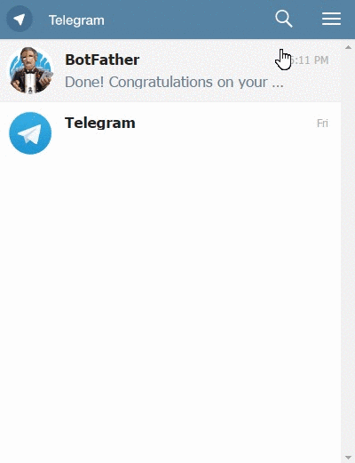
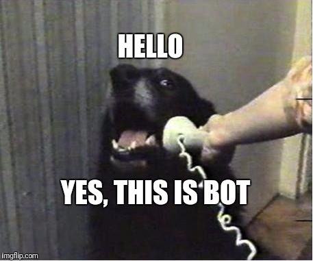

# Intergram - [Demo](https://www.intergram.xyz/)

A **Free** live chat widget that you can easily add to your website. It will let you chat with your website visitors using your Telegram messenger. 

#### :tada: Main Contributors :tada:
- [aslauris](https://github.com/aslauris) - Who redesgined the new UI! Check out his website - [wedofe.com](https://www.wedofe.com/)


##### How?
You initiate a chat with my Telegram bot and add 2 lines of script to your website to embed the widget. Visitors' messages are sent from the chat widget to my bot server, which sends them to your Telegram messenger where you can answer them. You can also self-host the bot server to get more control of this process.

##### Why use a Telegram bot to implement a chat widget?
By using a Telegram bot, I delegate all the message routing work and chat state management to Telegram. I don't have to build fancy mobile and desktop apps for several platforms because Telegram already has a great multiplatform chat client. And, I can easily handle a huge amount of load, because my app runs completely stateless (No database) and just serves as a pipe between Telegram and the chat widget users.

### Embed Intergram in your website with these 2 simple steps

1. Open [Telegram messenger](https://web.telegram.org/), search for `@Intergram` and hit `/start` to get your unique chat ID. ([direct link](https://web.telegram.org/#/im?p=@IntergramBot))

  <p align="center">  </p>

2. Paste this code snippet right before the closing body tag of every page where you want the chat to appear 
(Don't forget to add your actual chat ID). 

```html
<script> window.intergramId = "Your unique chat id" </script>
<script id="intergram" type="text/javascript" src="https://www.intergram.xyz/js/widget.js"></script>
```

*Note: replying to a specific message should be used to respond to that specific visitor. Sending a standard message will broadcast to all connected chat clients (You might find it easier to use if you have only one active conversation)*

**Important Notice:** I plan to keep the hosted chat service 100% free (no ads also!), but there are some hosting expenses (servers, domain, cdn, etc), so I will soon start bundeling a [Loadmill](https://www.loadmill.com) component with the Intergram script. Loadmill is a new concept and still in Beta - **If you don't feel comfortable with this, please use your own self hosted version.**

### Customization - [Try It](https://jsfiddle.net/z9ffzr9n/6/)
Currently you can customize all visible texts and the main widget color by setting an optional `intergramCustomizations` object in the injection script tag. (All its properties are also optional and will fallback to their original values)
```html
<script> 
    window.intergramId = "Your unique chat id";
    window.intergramCustomizations = {
        titleClosed: 'Closed chat title',
        titleOpen: 'Opened chat title',
        introMessage: 'First message when the user opens the chat for the first time',
        autoResponse: 'A message that is sent immediately after the user sends its first message',
        autoNoResponse: 'A message that is sent one minute after the user sends its first message ' +
                        'and no response was received',
        mainColor: "#E91E63", // Can be any css supported color 'red', 'rgb(255,87,34)', etc
        alwaysUseFloatingButton: false // Use the mobile floating button also on large screens
    };
</script>
<script id="intergram" type="text/javascript" src="https://www.intergram.xyz/js/widget.js"></script>
```

<p align="center">  </p>

### Initial Footprint
  - Using [Preact](https://github.com/developit/preact) helped creating a pretty minimal `js` bundle.
  - The widget injection script is about 5KB gziped and executes only after the host page finished loading ('onload' event).
  - The chat iframe will only be loaded if the user interacts with the chat widget (currently about 40KB gziped).
  


### Deploy your own Intergram instance (Self Hosting)
1. Talk to Telegram [@BotFather](https://telegram.me/botfather), create a new bot and get its API Token.

2. Deploy this repo to your own chat server. 
  - Clone it locally and install or if you use Heroku, fork this repository and point the new app to it.
  - Set an .env variable named `TELEGRAM_TOKEN` with the value you got from @BotFather

3. Point the bot webhook to your bot server by making a `GET` request to the following url
  `https://api.telegram.org/bot<TOKEN>/setWebhook?url=<Server url>/hook`
  (Don't forget to replace with your token and server url)

4. Open a chat with your bot and hit `/start` to get your unique chat ID

5. Embed this code snippet in your website
  ```html
  <script> 
      window.intergramId = "Your unique chat ID"
      window.intergramServer = "Server url"
  </script>
  <script id="intergram" type="text/javascript" src="<Server url>/js/widget.js"></script>
  ```
6. :tada:
