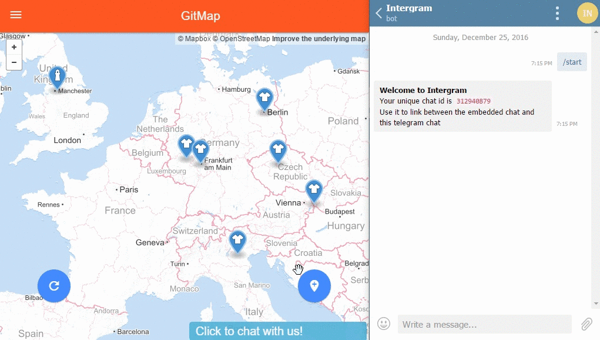

# Intergram

**Free** live chat widget linked to your telegram messenger.


#### Embed Intergram in your website with these 2 simple steps

1. Open Telegram, search for `@Intergram` and hit `/start` to get your unique chat ID.

<p align="center">
  
</p>

2. Paste this snippet right before the closing body tag of every page where you want the chat to appear (Don't forget to add your real chat ID). 

```html
<script> window.intergramId = <Your unique chat ID> </script>
<script id="intergram" type="text/javascript" src="https://intergram.herokuapp.com/js/widget.js"></script>
```


 
